# Роудмап: с нуля до Automation QA (Python)

**Стартовая точка:** нет опыта разработки, есть год работы UI/UX дизайнером, медицинский бэкграунд (аналитическое мышление, внимание к деталям, умение работать с документацией — это реально плюс в QA).
**Цель:** уровень middle Automation QA.
**Режим:** параллельно с работой дизайнером, **10–15 часов в неделю** (5–6 дней по 1.5–2.5 часа).
**Язык:** Python.

---

## 0. Честно про сроки и про слово «мидл»

Мидл — это не набор знаний, это **знания + примерно 1–1.5 года боевого опыта**. Поэтому план разбит на две части:

| Горизонт | Что получаем | Срок при 10–15 ч/нед |
|---|---|---|
| **Фаза 1** | Скилл-сет и портфолио уровня **strong junior / junior+**, готовность к собеседованиям | ~10–11 месяцев |
| **Фаза 2** | Первая работа + добор до **middle** (архитектура фреймворков, CI, нагрузка, менторство) | ещё 10–14 месяцев |

То есть реалистичный горизонт «я — мидл» — **примерно 2 года** с сегодняшнего дня. Это нормальный, а не пессимистичный срок: люди, которые обещают мидла за 6 месяцев, продают курс.

Если получится выделять 20+ часов в неделю — Фаза 1 сожмётся до 7–8 месяцев.

---

## 1. Схема маршрута

```mermaid
flowchart TD
    S[Старт: 0 опыта в коде] --> M0

    M0["Мес. 0-1<br/>Окружение, Git, командная строка<br/>+ теория тестирования"]
    M0 --> M12

    M12["Мес. 1-3<br/>ТРЕК A: ручное тестирование, тест-дизайн, документация, DevTools, HTTP<br/>ТРЕК B: Python база — типы, циклы, функции, файлы, исключения"]
    M12 --> M3

    M3["Мес. 3-4<br/>Python ООП + модули + venv<br/>SQL и базы данных"]
    M3 --> M5

    M5["Мес. 5<br/>API: REST, Postman, Swagger, requests<br/>Первый чекпоинт: могу тестировать API руками и скриптом"]
    M5 --> M6

    M6["Мес. 6<br/>Pytest: фикстуры, параметризация, маркеры<br/>Автотесты API на pytest + requests + Allure"]
    M6 --> M78

    M78["Мес. 7-8<br/>UI-автоматизация: Selenium / Playwright<br/>Локаторы, ожидания, Page Object Model"]
    M78 --> M9

    M9["Мес. 9<br/>Linux, Docker, CI/CD (GitHub Actions / Jenkins)<br/>Отчёты, параллельный запуск, борьба с флаками"]
    M9 --> M10

    M10["Мес. 10-11<br/>Финальный проект: UI + API + БД в одном фреймворке<br/>Резюме, GitHub, мок-интервью, отклики"]
    M10 --> JOB

    JOB(["Работа: Junior / Junior+ Automation QA"])
    JOB --> MID

    MID["Фаза 2 — до мидла<br/>Архитектура фреймворков, нагрузка Locust,<br/>моки, контрактные тесты, наставничество"]
    MID --> GOAL(["Middle Automation QA"])
```

**Принцип всего плана:** теория и практика идут одновременно. Каждую неделю есть блок «читаю/смотрю» и блок «пишу руками». Ни одна тема не считается пройденной, пока по ней нет артефакта: кода в GitHub, чек-листа, бага в трекере.

---

## 2. Недельный ритм (шаблон)

| День | Что делаем | Время |
|---|---|---|
| Пн | Трек B: Python — новая тема + задачи | 2 ч |
| Вт | Трек A: теория QA — новая тема + конспект | 1.5 ч |
| Ср | Трек B: Python — задачи, закрепление | 2 ч |
| Чт | Трек A: практика — тест-кейсы / баги / инструменты | 1.5 ч |
| Пт | Выходной от учёбы (обязательно) | — |
| Сб | Проект недели: связываем теорию и код | 3 ч |
| Вс | Разбор с ментором (со мной), вопросы, ретро недели | 1 ч |

**Итого: 11 часов/неделя.** Раз в 6 недель — неделя разгрузки: только повторение и проект, без новых тем. Это защита от выгорания, а не слабость.

**Ретро каждое воскресенье, 3 вопроса:**
1. Что я на этой неделе научилась делать, чего не умела в понедельник?
2. Где я застряла и потеряла больше 40 минут?
3. Что перенести/выкинуть из плана следующей недели?

---

## 3. Этапы подробно

---

### ЭТАП 0. Окружение и старт
**Срок: 1 неделя (~10 ч)**

**Теория / темы:**
- Кто такой QA, QC, тестировщик. Разница между manual и automation QA.
- Как вообще устроен веб: клиент, сервер, браузер, что происходит при вводе URL.
- Что такое IDE, интерпретатор, терминал, репозиторий.

**Практика:**
- Установить: Python 3.12+, PyCharm Community (или VS Code + расширения Python), Git.
- Завести GitHub, настроить SSH-ключ, сделать первый репозиторий `qa-learning`.
- Освоить базовый терминал: `cd`, `ls`, `pwd`, `mkdir`, `rm`, `cat`, `touch`, `python file.py`.
- Markdown: писать конспекты в `.md` прямо в репозитории.
- Завести Notion/Obsidian под конспекты + трекер прогресса.

**Критерий готовности:** есть репозиторий на GitHub с папкой `notes/` и первым коммитом; умею запускать `.py`-файл из терминала без гугления.

---

### ЭТАП 1. Теория тестирования и ручное тестирование
**Срок: 5–6 недель (идёт параллельно с Python), ~35 ч**

Это фундамент. Автоматизатор, который не умеет тестировать руками, пишет бесполезные автотесты.

**Темы теории:**

*1.1 База*
- Что такое тестирование, цель тестирования. QA vs QC vs Testing.
- 7 принципов тестирования (наличие дефектов, исчерпывающее тестирование невозможно, раннее тестирование, кластеризация дефектов, парадокс пестицида, зависимость от контекста, заблуждение об отсутствии ошибок).
- Верификация и валидация.
- Ошибка / дефект / отказ (error / defect / failure).
- Цена бага на разных этапах разработки.

*1.2 Процессы*
- SDLC и STLC — жизненный цикл ПО и жизненный цикл тестирования.
- Модели разработки: waterfall, V-model, итеративная, Agile.
- Scrum: роли, спринт, дейли, планирование, ретро, грумминг. Kanban.
- Место QA в спринте, definition of done, definition of ready.
- Shift-left подход.

*1.3 Виды и уровни тестирования*
- Уровни: unit → integration → system → acceptance.
- Пирамида тестирования и «мороженое» (антипаттерн).
- Функциональное и нефункциональное (производительность, нагрузочное, стресс, юзабилити, безопасность, совместимость, локализация).
- Типы: smoke, sanity, regression, re-test, e2e, exploratory, ad-hoc, монки.
- Позитивное / негативное.
- Black box, white box, grey box.
- Статическое и динамическое тестирование.

*1.4 Тест-дизайн (одна из самых важных тем для собеседования)*
- Эквивалентное разделение (equivalence partitioning).
- Анализ граничных значений (boundary value analysis).
- Таблица решений (decision table).
- Диаграмма состояний и переходов (state transition).
- Попарное тестирование (pairwise, all-pairs).
- Тестирование на основе сценариев использования (use case).
- Предугадывание ошибок (error guessing).
- Причина-следствие.

*1.5 Документация*
- Требования: виды, атрибуты хорошего требования (полнота, однозначность, атомарность, тестируемость), как тестировать требования.
- Чек-лист vs тест-кейс: когда что.
- Структура тест-кейса: ID, заголовок, предусловия, шаги, ожидаемый результат, постусловия, приоритет.
- Баг-репорт: заголовок, окружение, шаги воспроизведения, фактический и ожидаемый результат, вложения, логи.
- Severity vs Priority — разница, примеры матрицы.
- Тест-план (что внутри по IEEE 829), тест-стратегия, тест-отчёт.
- Жизненный цикл бага (New → Assigned → In Progress → Fixed → Verified → Closed / Reopened / Rejected / Deferred).
- Метрики: test coverage, pass rate, defect density.
- Тестовые данные, окружения (dev/test/stage/prod).

*1.6 Технический минимум*
- Клиент-серверная архитектура, трёхзвенная архитектура.
- HTTP/HTTPS: методы (GET, POST, PUT, PATCH, DELETE, OPTIONS, HEAD), идемпотентность.
- Коды ответов: 1xx, 2xx (200, 201, 204), 3xx (301, 302, 304), 4xx (400, 401, 403, 404, 405, 409, 422, 429), 5xx (500, 502, 503, 504).
- Заголовки: Content-Type, Authorization, Accept, User-Agent, Set-Cookie.
- Cookies, session, localStorage, sessionStorage, JWT — что это и в чём разница.
- DNS, IP, порты, URL-структура.
- HTML/CSS в объёме «понять вёрстку и найти элемент» — тут дизайнерский бэкграунд сильно помогает.
- DevTools: вкладки Elements, Console, Network (посмотреть запрос, заголовки, тело ответа), Application (куки и сторадж), Device toolbar.
- Кросс-браузерное и адаптивное тестирование.

**Вопросы для самопроверки (устно, вслух):**
1. Чем severity отличается от priority? Приведи баг с низким severity и высоким priority.
2. Что тестировать в первую очередь, если на регресс дали 2 часа вместо двух дней?
3. Сколько тест-кейсов нужно на поле «возраст от 18 до 65» по эквивалентным классам и граничным значениям?
4. Что такое парадокс пестицида и как с ним бороться?
5. В чём разница между 401 и 403? Между 301 и 302?
6. Клиент получает 500. Какие шаги ты предпримешь, чтобы завести адекватный баг?
7. Что такое smoke-тестирование и когда оно запускается?
8. Зачем нужна пирамида тестирования и почему UI-тестов должно быть меньше всего?

**Практика:**
- Выбрать 2 реальных сайта (например, интернет-магазин + сервис бронирования) и написать **чек-лист на 60+ пунктов** для одной фичи.
- Написать **20 тест-кейсов** в TestRail / Qase / Google Sheets (форма roles: позитивные и негативные).
- Найти и оформить **15 реальных багов** на тренировочных сайтах и в реальных продуктах. Учебные площадки: сайты с намеренными багами (buggy-приложения), demo-магазины, тестовые стенды.
- Завести бесплатную Jira/YouTrack, вести баги там, а не в блокноте.
- Разобрать 5 произвольных страниц через DevTools → Network: какие запросы уходят, что в ответе.
- Написать тест-план на одну небольшую фичу (2–3 страницы).

**Критерий готовности:** могу за 40 минут взять незнакомую фичу, задать вопросы по требованиям, составить чек-лист и найти 5+ дефектов; баг-репорты не вызывают вопросов «а что ты вообще делала?».

---

### ЭТАП 2. Python с нуля
**Срок: 10–12 недель (параллельно с Этапом 1), ~70 ч**

Главное правило этапа: **не смотреть курсы, а писать код**. Соотношение 20% чтение / 80% руки.

**Темы:**

*2.1 База*
- Синтаксис, отступы, комментарии, PEP8.
- Переменные, типы: int, float, str, bool, None.
- Операторы: арифметические, сравнения, логические, `in`, `is` vs `==`.
- Приведение типов, `input()`, `print()`, f-строки.

*2.2 Структуры данных*
- Строки: индексация, срезы, методы (`split`, `join`, `strip`, `replace`, `lower`, `find`, `startswith`), неизменяемость.
- Списки: методы, срезы, сортировка, `sorted` vs `sort`.
- Кортежи, множества (и зачем они в тестировании — сравнение наборов), словари: методы, вложенность, итерация.
- List/dict comprehensions.
- Изменяемые vs неизменяемые типы, копирование, `deepcopy`.

*2.3 Логика*
- `if / elif / else`, тернарный оператор.
- Циклы `for`, `while`, `range`, `enumerate`, `zip`, `break`, `continue`, `else` у цикла.

*2.4 Функции*
- Объявление, аргументы позиционные и именованные, значения по умолчанию.
- `*args`, `**kwargs`.
- `return`, множественный возврат.
- Область видимости, LEGB, `global`.
- Лямбды, `map`, `filter`, `sorted(key=...)`.
- Рекурсия (базово).

*2.5 Модули и окружение*
- `import`, `from ... import`, `if __name__ == "__main__"`.
- Стандартная библиотека: `os`, `sys`, `json`, `csv`, `datetime`, `random`, `re` (базовые регулярки), `pathlib`, `logging`.
- `venv`, `pip`, `requirements.txt`, установка сторонних пакетов.
- Структура проекта на Python.

*2.6 Файлы и исключения*
- Чтение/запись файлов, контекстный менеджер `with`.
- Работа с JSON и CSV.
- `try / except / else / finally`, типы исключений, `raise`, свои исключения.

*2.7 ООП (критично для автотестов и Page Object)*
- Класс и объект, `__init__`, `self`.
- Атрибуты класса и экземпляра, методы.
- Инкапсуляция (`_`, `__`), `@property`.
- Наследование, `super()`, множественное наследование, MRO (обзорно).
- Полиморфизм, композиция vs наследование.
- `@staticmethod`, `@classmethod`.
- Магические методы: `__str__`, `__repr__`, `__eq__`, `__len__`.
- Обзорно: абстрактные классы, dataclasses.

*2.8 Чуть дальше*
- Декораторы (без них не понять pytest).
- Генераторы, итераторы, `yield`.
- Типизация (`typing`), аннотации.
- Линтеры и форматтеры: `ruff` / `flake8`, `black`.

**Вопросы для самопроверки:**
1. Чем список отличается от кортежа и когда что выбрать?
2. Что напечатает функция с изменяемым аргументом по умолчанию `def f(x=[])`?
3. Разница между `is` и `==`?
4. Что такое `self` и почему он первым аргументом?
5. Зачем нужен `super()`?
6. Что делает декоратор и как написать свой?
7. Чем `@staticmethod` отличается от `@classmethod`?
8. Что произойдёт, если исключение возникнет в блоке `finally`?

**Практика (обязательные мини-проекты):**
1. **Калькулятор с меню** — циклы, функции, обработка ошибок ввода.
2. **Генератор тестовых данных** — случайные email, телефоны, ФИО, даты; выгрузка в JSON и CSV. Библиотека `Faker`.
3. **Парсер JSON-отчёта** — читает файл с результатами тестов, считает pass/fail, печатает сводку.
4. **Мини-адресная книга на ООП** — классы `Contact` и `AddressBook`, сохранение в файл, CRUD.
5. **Скрипт-чекер ссылок** — проходит по списку URL, дёргает их и печатает коды ответов (уже мостик к API).
- Плюс регулярные задачи: 5–8 задач в неделю на Codewars (8–6 kyu) или Stepik.

**Критерий готовности:** могу с нуля написать класс с наследованием, обработать исключения, прочитать JSON и не гуглить синтаксис цикла.

---

### ЭТАП 3. Git и работа в команде
**Срок: 1–2 недели, вплетается в Этап 2, ~8 ч**

**Темы:**
- Что такое VCS, локальный и удалённый репозиторий.
- `init`, `clone`, `status`, `add`, `commit`, `push`, `pull`, `fetch`, `log`, `diff`.
- Ветки: `branch`, `checkout` / `switch`, `merge`, конфликты и их разрешение.
- `rebase` — что это и когда опасно.
- `.gitignore`, `stash`, `reset` vs `revert`, `cherry-pick`.
- Pull Request, код-ревью, требования к коммит-сообщениям (Conventional Commits).
- Git Flow / trunk-based (обзорно).

**Практика:** весь учебный код с этого момента живёт в GitHub, каждая фича — отдельная ветка и PR (даже если ревьюер — только твой парень и я). Минимум 3 разрешённых конфликта руками.

**Критерий готовности:** «случайно сломала ветку» больше не вызывает паники.

---

### ЭТАП 4. SQL и базы данных
**Срок: 3 недели, ~20 ч**

**Темы:**
- Реляционная модель: таблицы, строки, столбцы, типы данных.
- Первичный и внешний ключ, связи 1:1, 1:N, N:M.
- Нормализация (1НФ–3НФ) — обзорно, но понимать зачем.
- `SELECT`, `FROM`, `WHERE`, операторы `AND/OR/NOT`, `IN`, `BETWEEN`, `LIKE`, `IS NULL`.
- `ORDER BY`, `LIMIT`, `OFFSET`, `DISTINCT`, алиасы.
- Агрегатные функции: `COUNT`, `SUM`, `AVG`, `MIN`, `MAX`.
- `GROUP BY`, `HAVING` (и разница между `WHERE` и `HAVING`).
- JOIN: `INNER`, `LEFT`, `RIGHT`, `FULL`, `CROSS`, self-join. Уметь рисовать на бумаге.
- Подзапросы, `UNION` / `UNION ALL`.
- `INSERT`, `UPDATE`, `DELETE`; `CREATE TABLE`, `ALTER`, `DROP` vs `TRUNCATE`.
- Индексы — зачем и когда мешают.
- Транзакции, ACID, уровни изоляции (обзорно).
- NoSQL обзорно: MongoDB, документная модель, когда используют.
- Python + БД: `psycopg2` / `sqlalchemy` — как проверять данные из автотеста.

**Вопросы для самопроверки:**
1. Разница между `INNER JOIN` и `LEFT JOIN` — на примере таблиц users и orders.
2. Чем `WHERE` отличается от `HAVING`?
3. Как найти дубликаты в таблице?
4. Что вернёт `COUNT(*)` против `COUNT(column)` при наличии NULL?
5. Чем `DELETE` отличается от `TRUNCATE` и `DROP`?
6. Зачем тестировщику лезть в базу, если есть UI?

**Практика:**
- Развернуть PostgreSQL локально (лучше сразу в Docker) + DBeaver.
- Пройти 50+ задач на SQL-тренажёре (sql-ex.ru, SQLBolt, LeetCode Database).
- Своя учебная схема: users, orders, products, order_items — наполнить данными, написать 25 запросов разной сложности.
- Скрипт на Python: подключается к БД, проверяет, что после «регистрации» появилась строка в `users`.

**Критерий готовности:** пишу запрос с двумя JOIN и группировкой без подсказок.

---

### ЭТАП 5. Тестирование API
**Срок: 4–5 недель, ~30 ч**

**Темы:**
- Что такое API, зачем тестировать на уровне API, преимущества перед UI-тестами.
- REST: принципы, ресурсы, statelessness. SOAP и GraphQL — обзорно, для эрудиции.
- JSON и XML: структура, вложенность, массивы.
- Повтор HTTP: методы, коды, заголовки, тело запроса, query- и path-параметры.
- Авторизация: Basic Auth, API key, Bearer token, JWT (структура: header.payload.signature), OAuth 2.0 (обзорно).
- Swagger / OpenAPI: читать спецификацию, дёргать эндпоинты из UI.
- Postman: запросы, коллекции, окружения и переменные, pre-request scripts, тесты на JS, chaining запросов, runner, Newman.
- Что проверять в API-тесте: код ответа, тело, схему, заголовки, время ответа, идемпотентность, негативные сценарии, авторизацию, валидацию полей.
- Контрактное тестирование и валидация схемы.
- Моки и стабы: зачем, чем отличаются.
- `requests` в Python: `get/post/put/delete`, `params`, `json`, `headers`, `Session`, работа с ответом.
- `pydantic` / `jsonschema` для валидации ответов.

**Вопросы для самопроверки:**
1. Чем PUT отличается от PATCH? А от POST?
2. Что такое идемпотентность и какие методы идемпотентны?
3. Что внутри JWT и можно ли ему доверять на клиенте?
4. Сервер вернул 200, но в теле `{"error": "not found"}` — это баг?
5. Какие негативные кейсы придумаешь для эндпоинта регистрации?
6. Зачем нужен мок-сервер, если есть настоящий бэкенд?

**Практика:**
- Прогнать открытые учебные API (reqres, Petstore/Swagger, JSONPlaceholder, Restful-booker) руками через Postman.
- Собрать **коллекцию Postman на 30+ запросов** с окружениями, переменными и тестами; прогнать через Newman.
- Написать **чек-лист тестирования эндпоинта** (позитив + негатив + авторизация + граничные значения).
- Переписать 10 постмановских проверок на Python + `requests` (пока просто скриптом с `assert`).
- Валидировать ответ через `pydantic`-модель.

**Критерий готовности:** дают ссылку на Swagger — за час составляю тест-чек-лист и покрываю ключевые эндпоинты скриптом.

---

### ЭТАП 6. Pytest — ядро автоматизации
**Срок: 4 недели, ~28 ч**

**Темы:**
- Зачем нужен фреймворк, `unittest` vs `pytest`.
- Установка, соглашения об именовании (`test_*.py`, `test_*`), запуск, флаги (`-v`, `-k`, `-m`, `-x`, `--lf`, `-s`).
- `assert` и разбор ошибок, `pytest.raises`, `pytest.approx`.
- Фикстуры: `@pytest.fixture`, `yield`, setup/teardown, scope (`function`, `class`, `module`, `session`), `autouse`.
- `conftest.py` и иерархия фикстур.
- Параметризация: `@pytest.mark.parametrize`, параметризация фикстур, `ids`.
- Маркеры: свои маркеры, `skip`, `skipif`, `xfail`.
- Конфигурация: `pytest.ini` / `pyproject.toml`, `addopts`.
- Хуки: `pytest_addoption`, `pytest_runtest_makereport` (для скриншотов при падении).
- Плагины: `pytest-xdist` (параллель), `pytest-rerunfailures`, `pytest-html`, `pytest-timeout`, `allure-pytest`.
- Отчёты Allure: шаги, вложения, severity, epic/feature/story, история запусков.
- Структура тестового проекта: `tests/`, `pages/`, `api/`, `utils/`, `data/`, `conftest.py`, `requirements.txt`, `README.md`.
- Принципы хороших автотестов: изолированность, атомарность, независимость от порядка, отсутствие sleep, понятные названия, AAA (Arrange-Act-Assert).

**Вопросы для самопроверки:**
1. Что делает фикстура со scope=session и когда это опасно?
2. Как передать данные из фикстуры в тест и почему `yield` лучше `teardown`?
3. Чем `skip` отличается от `xfail`?
4. Как запустить только тесты с маркером `smoke`?
5. Почему автотесты не должны зависеть друг от друга?
6. Что такое флакающий тест и как его чинить?

**Практика:**
- Переписать все API-скрипты из Этапа 5 в **полноценный pytest-проект**: фикстуры на авторизацию и тестовые данные, параметризация негативных кейсов, маркеры `smoke`/`regression`, отчёт Allure.
- 40+ тестов, зелёный прогон, README с инструкцией запуска.
- Добавить проверку данных в PostgreSQL после API-вызова (связка Этап 4 + 6).

**Критерий готовности:** есть публичный репозиторий с API-автотестами, который не стыдно показать на собеседовании.

---

### ЭТАП 7. UI-автоматизация
**Срок: 7–8 недель, ~55 ч**

Здесь дизайнерский опыт даёт фору: понимание вёрстки, состояний и компонентов очень помогает с локаторами.

**Темы:**

*7.1 Основы*
- Архитектура Selenium WebDriver, драйверы, `webdriver-manager` / Selenium Manager.
- Playwright: чем отличается, auto-waiting, контексты, `codegen`, trace viewer.
- Что выбрать под задачу (в 2026 Playwright быстро растёт, Selenium всё ещё доминирует в вакансиях — учим оба, глубже один).

*7.2 Поиск элементов*
- Локаторы: id, name, class name, tag, link text, CSS-селекторы, XPath.
- XPath: абсолютный/относительный, оси, `contains()`, `text()`, `following-sibling`.
- Приоритет локаторов, почему абсолютный XPath — зло.
- Работа с динамическими элементами, `data-testid` и договорённости с разработчиками.

*7.3 Взаимодействие*
- Клики, ввод текста, очистка, отправка форм.
- Dropdown / `Select`, чекбоксы, радио, загрузка файлов.
- `ActionChains`: hover, drag-and-drop, двойной клик, правый клик, клавиатура.
- Алерты, iframe, работа с несколькими вкладками и окнами.
- Скроллинг, JS-executor.
- Скриншоты, в том числе при падении теста.
- Cookies, localStorage, авторизация в обход UI (быстрее и стабильнее).

*7.4 Ожидания (главная причина флаков)*
- Implicit wait, explicit wait (`WebDriverWait` + `expected_conditions`), fluent wait.
- Почему `time.sleep()` — красный флаг на собеседовании.
- Свои условия ожидания.

*7.5 Архитектура*
- Page Object Model: страницы, элементы, действия.
- Base Page, компоненты, Fluent-интерфейс.
- Разделение слоёв: тесты / страницы / данные / утилиты.
- DRY, KISS, когда POM избыточен.
- Конфиги, переменные окружения, разные стенды.
- Тестовые данные: фабрики, `Faker`, подготовка через API вместо UI.
- Headless-режим, разные браузеры, размеры окна.
- Selenoid / Selenium Grid — параллельный запуск в контейнерах.
- Борьба с флаками: ретраи, стабильные локаторы, изоляция данных.

**Вопросы для самопроверки:**
1. Чем implicit wait отличается от explicit и почему их нельзя смешивать?
2. Напиши CSS-селектор и XPath для кнопки внутри формы с определённым классом.
3. Что такое Page Object и какую проблему он решает?
4. Почему авторизацию в тестах лучше делать через API?
5. Почему UI-тестов должно быть мало и какие сценарии в них оставляют?
6. Тест падает раз в 10 прогонов. Твои действия?

**Практика:**
- 10 разминочных тестов на учебных сайтах (тренировочные стенды с формами, таблицами, драг-н-дропом, алертами).
- **Проект: UI-автотесты интернет-магазина** — регистрация, логин, поиск, фильтры, корзина, оформление заказа. 25–35 тестов на POM.
- Скриншоты и логи в Allure при падении.
- Параллельный запуск через `pytest-xdist`.
- Отдельный небольшой проект на Playwright для сравнения — 10 тестов.

**Критерий готовности:** второй серьёзный репозиторий в портфолио; могу объяснить архитектуру своего фреймворка на белой доске.

---

### ЭТАП 8. Инфраструктура: Linux, Docker, CI/CD
**Срок: 3–4 недели, ~25 ч**

**Темы:**
- Linux: файловая система, права (`chmod`), `grep`, `find`, `tail -f`, `ps`, `kill`, переменные окружения, ssh, чтение логов приложения.
- Docker: образ vs контейнер, `Dockerfile`, `docker build/run/ps/logs/exec`, volumes, сети, `docker-compose`.
- Запуск тестов в контейнере, поднятие БД и Selenoid через compose.
- YAML — синтаксис.
- CI/CD: что такое пайплайн, стадии, артефакты, триггеры.
- GitHub Actions: workflow, jobs, steps, matrix, secrets, расписание (cron).
- Jenkins: job, pipeline, Jenkinsfile, параметры сборки, публикация Allure-отчёта (обзорно, но знать надо — в вакансиях встречается часто).
- Где живут отчёты и как их показывать команде.
- Стратегия запусков: смоук на каждый PR, регресс — ночью.

**Вопросы для самопроверки:**
1. Зачем автотесты запускать в Docker?
2. Что такое артефакт сборки и что мы туда кладём?
3. Как передать пароль в пайплайн, не положив его в репозиторий?
4. Почему регресс гоняют ночью, а смоук — на каждый коммит?

**Практика:**
- Обернуть свой UI-проект в Docker.
- Поднять Selenoid + браузеры через docker-compose, прогнать тесты в нём.
- Настроить GitHub Actions: запуск тестов на push в main + публикация Allure-отчёта на GitHub Pages.
- Сделать бейдж со статусом тестов в README.

**Критерий готовности:** в резюме честно написано «настраивала CI для автотестов», и это можно показать.

---

### ЭТАП 9. Финальный проект + выход на рынок
**Срок: 5–6 недель, ~40 ч**

**Финальный проект — один репозиторий, который закрывает всё:**
- Слой API-тестов (`requests` + `pydantic`).
- Слой UI-тестов (Page Object).
- Проверки в БД.
- Общие фикстуры, конфиги под несколько окружений.
- Тестовые данные через фабрики.
- Allure-отчёт со степами и скриншотами.
- Docker + docker-compose.
- CI-пайплайн с разделением smoke/regression.
- Внятный README: что это, как запустить, какая архитектура, скриншоты отчёта.
- Плюс тестовая документация: тест-план, чек-листы, примеры баг-репортов — покажет, что ты не «кодер без QA-мышления».

**Трудоустройство:**
- Резюме: как переупаковать медицинский и дизайнерский опыт в плюсы (работа с требованиями, внимание к деталям, эмпатия к пользователю, понимание UX — редкое и ценное сочетание в QA).
- GitHub-профиль: закреплённые репозитории, нормальные README.
- Сопроводительное письмо под вакансию.
- Разбор 150 типовых вопросов собеседования (теория тестирования, Python, SQL, API, Selenium, Git).
- Живое кодирование: 20–30 типовых задач (перевернуть строку, найти дубликаты, посчитать частоту символов, работа со словарями и списками).
- 3–5 мок-интервью со мной, потом реальные собеседования — первые 5 воспринимаем как бесплатную практику, а не как экзамен.
- Стратегия откликов: 10–15 в неделю, вести таблицу.

---

## 4. Фаза 2 — от джуна до мидла (после трудоустройства)

Уже на работе, параллельно:
- Архитектура тестовых фреймворков с нуля, паттерны, разделение слоёв.
- Нагрузочное тестирование: Locust (Python) / JMeter, метрики, отчёты.
- Мобильная автоматизация: Appium (если попадёшь в мобильную команду).
- BDD: `pytest-bdd` / `behave`, Gherkin — по необходимости проекта.
- Мокирование и виртуализация сервисов: WireMock, `responses`.
- Контрактное тестирование (Pact) — обзорно.
- Основы безопасности: OWASP Top 10, XSS, SQL-инъекции, CSRF.
- Мониторинг и логи: Kibana/Grafana, чтение логов в проде.
- Test management, оценка трудозатрат, ревью чужих тестов, наставничество над стажёром.
- Английский до уверенного чтения документации и созвонов (сильно влияет на вилку).

---

## 5. Контрольные точки

| Чекпоинт | Когда | Что должно быть сделано |
|---|---|---|
| **CP1** | конец 2 мес. | Чек-листы и 20 тест-кейсов; 10 багов в Jira; Python: циклы, функции, словари уверенно |
| **CP2** | конец 4 мес. | ООП-проект на Python; 50 SQL-задач; свободный Git |
| **CP3** | конец 6 мес. | API-автотесты на pytest с Allure в GitHub |
| **CP4** | конец 8 мес. | UI-фреймворк на POM, 25+ тестов |
| **CP5** | конец 9 мес. | Всё в Docker + зелёный CI-пайплайн |
| **CP6** | конец 11 мес. | Финальный проект, резюме, первые отклики |

На каждом чекпоинте — мок-интервью по пройденному материалу. Проваленный чекпоинт не значит «отстаём», значит «повторяем 1–2 недели и идём дальше».

---

## 6. Как мы будем работать вместе

**Мои роли:**
- **Объясняю** темы простым языком, с примерами из QA, а не абстрактными.
- **Ревьюю код** — присылай ссылку на репозиторий или код в чат, разбираю построчно.
- **Проверяю тест-кейсы и баг-репорты** — как настоящий тимлид, с замечаниями.
- **Даю задачи** под текущую тему, с разной сложностью.
- **Провожу мок-интервью** и задаю вопросы так, как их задают на реальных собеседованиях.
- **Держу мотивацию** — на 3-м и 7-м месяце будет провал мотивации, это статистика, а не твоя личная слабость.

**Твои правила, которые нельзя нарушать:**
1. Прежде чем спросить меня — 20 минут пытаешься сама (гугл, документация, ошибка целиком прочитана). Умение застревать и выкарабкиваться — это и есть навык разработчика.
2. Спрашиваешь после 20 минут — обязательно. Сидеть в тупике 3 часа из гордости — потеря времени.
3. Код пишешь руками, не копипастой. Скопированный и не понятый код = тема не пройдена.
4. Каждый день, когда учишься, — коммит в GitHub. Даже маленький.
5. Ошибки читаешь целиком, снизу вверх. Не скринишь мне «не работает».
6. Один выходной от учёбы в неделю. Обязательно.

**Формат вопросов ко мне, который экономит нам обоим время:**
- Что делаю → что ожидала → что получилось → полный текст ошибки → что уже пробовала.

---

## 7. Три вещи, которые чаще всего ломают такие переходы

1. **Попытка выучить всё до идеала перед следующей темой.** Python на 60% достаточно, чтобы начать pytest. Возвращаться и доучивать — нормально.
2. **Пропуск ручного тестирования ради «скорее автотесты».** Автоматизатор, не умеющий проектировать тесты, автоматизирует бессмыслицу. Это отсеивается на первом же собеседовании.
3. **Портфолио «по туториалу».** Пять репозиториев, повторяющих один курс, стоят меньше, чем один свой проект с внятным README и осмысленной архитектурой.

---

## 8. Адаптация под рынок: РФ/СНГ + аутсорс

**Целевой рынок:** преимущественно РФ и СНГ, с возможным выходом на аутсорс/аутстафф-компании.

### Приоритеты стека

| Область | Основное (учим глубоко) | Второе (учим обзорно) |
|---|---|---|
| UI-автоматизация | **Selenium WebDriver** | Playwright |
| Отчётность | **Allure** (обязательно), Allure TestOps | pytest-html |
| Параллельный запуск | **Selenoid** (Aerokube) | Selenium Grid |
| CI | **GitLab CI**, Jenkins | GitHub Actions (для портфолио) |
| БД | **PostgreSQL** | MySQL, MongoDB обзорно |
| Трекеры | Jira / YouTrack / Yandex Tracker / Kaiten | — |
| TMS | TestIT, Qase, Allure TestOps | TestRail |

### Что усиливаем относительно базового плана

1. **Теория тестирования — не сокращать.** На собеседованиях в РФ её спрашивают близко к тексту: 7 принципов, техники тест-дизайна, severity vs priority, уровни и виды тестирования. Этап 1 отрабатываем до состояния «отвечаю без запинки».
2. **SQL и live coding — обязательные пункты интервью.** Практически на каждом собеседовании будет задача на JOIN + группировку и простая задача на Python. Держим их в тонусе повторением раз в 2 недели с 5-го месяца.
3. **GitLab CI добавляем к этапу 8.** Достаточно уметь прочитать `.gitlab-ci.yml`, понимать stages/jobs/artifacts/runners и объяснить, как туда встроены автотесты.
4. **Allure — на каждом проекте с этапа 6.** Не «в конце прикрутим», а сразу: шаги, вложения, скриншоты, severity, epic/feature/story.

### Дополнительный трек: английский (для аутсорса)

Аутсорс-компании фильтруют по английскому на входе. Цель — **уверенный B1 к моменту откликов**, дальше растим уже на работе.

- Формат: 20–30 минут в день, фоном, **вне** основных 10–15 часов учёбы.
- Месяцы 1–4: техническая лексика QA/разработки, чтение документации Selenium и pytest в оригинале вместо переводов.
- Месяцы 5–8: статьи и доклады по тестированию на английском, конспект своими словами.
- Месяцы 9–11: speaking-практика, самопрезентация «расскажите о себе» и рассказ о проектах на английском, мок-интервью на английском.

### Особенности аутсорса

- **Универсальность важнее узкой специализации:** один человек часто закрывает ручное + API + UI + коммуникацию с заказчиком. Блок ручного тестирования и тестовой документации — это преимущество, а не пройденный этап.
- **Тестовое задание почти всегда есть:** обычно 4–8 часов, чаще всего «напиши автотесты на этот сайт/API с отчётом и README». Финальный проект из этапа 9 — прямая подготовка к этому.
- **Быстрое переключение между проектами:** ценится умение с нуля разобраться в чужом фреймворке. На этапе 7–8 полезно разобрать 2–3 чужих открытых тестовых проекта на GitHub и описать их архитектуру своими словами.

---

*Роудмап живой: после первых 4–6 недель мы пересмотрим темп и переставим сроки под реальную скорость.*
